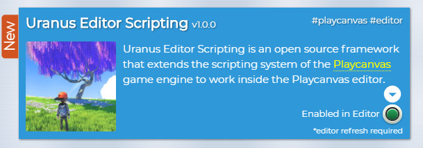
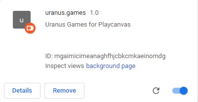
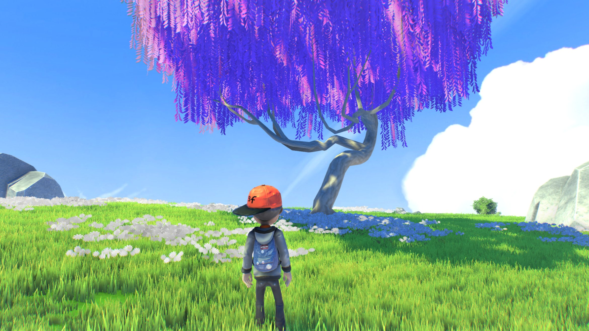
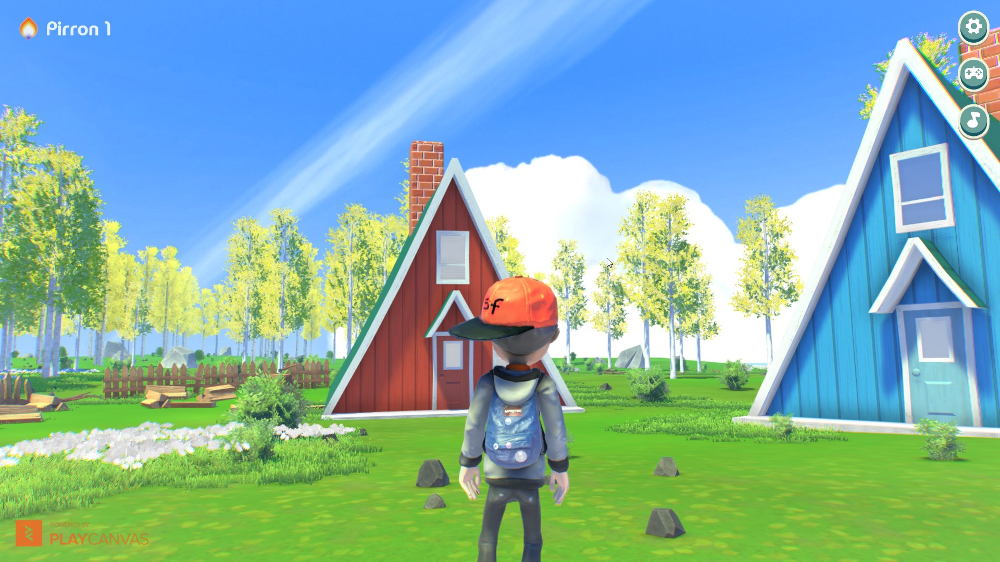

# Uranus Editor Scripting for Playcanvas

Uranus Editor Scripting is a framework that extends the scripting system of the [Playcanvas](https://playcanvas.com/) game engine to work inside the Playcanvas editor.

Building on top of the easiness of coding in the Playcanvas platform, any existing script can be easily extended to both execute in editor and run editor only code.

The Playcanvas team has already done a great job in providing the users with an excellent editor API (unofficial for the moment) and the editor UI components for use in user projects ([PCUI](https://github.com/playcanvas/pcui)).

The goal of this project is to fill the gab of editor scripting in Playcanvas until the official solution has been provided by the Playcanvas team.

## Use Cases

- Create custom editor tools that can easily interact and write to your scene entity hierarchy and create/update/delete assets on demand (e.g. procedural world generation, world painting tools, nav mesh generation etc.).
- Run runtime code in editor to easily visualize and work on your final view of your scene (e.g. shader effects, runtime generated models like terrains from heightmaps).
- Write importers/exporters to easily import or export content from your Playcanvas project (e.g. export a Playcanvas level to further model and re-import in an external modeling application).


## How it works?

The Playcanvas editor already runs a light instance of a pc.Application. The Uranus Editor SDK when initialized will execute the following actions:

1. Load any required modules, right now that would be Ammo.js to enable in editor physics execution.

2. Start the physics simulation and add all scene rigidbodies (static).

3. Start the main app loop update. Normally the editor executes the main render loop only when there is interaction with the viewport.

4. Preload all assets that have their preload flag enabled.

5. Initialize the script component in all script instances that have editor scripting enabled.

## How to use?

To enable any regular Playcanvas script to be parsed and executed in editor simply add the following attribute in your script and set it to true in editor:

```
MyScript.attributes.add("inEditor", {
  type: "boolean",
  default: true,
  title: "In Editor",
});
```

When the editor loads it searchs for any script that contains the `inEditor` attributes, adds it to the pc.Application scripts registry and executes it. Much like it would execute when launching the project.

If you would like to execute code in editor only you can use a special callback for that:

```
MyScript.prototype.editorInitialize = function () {
   // any code in this method will get executed automatically in editor
}
```

## How to install?

The Uranus Editor SDK is bundled in a single .js file which you have to upload to your Playcanvas project:

```
uranus-editor/dist/sdk/uranus-editor-sdk.js
```

There are three ways to initialize the Uranus Editor SDK:

1. The simplest one is to copy/paste in the browser console at your active editor tab the code found in the following loader file:

```
uranus-editor/src/loader/uranus-editor-loader.js
```

That isn't so convenient in the long term.

2. You can install the [Playing In Canvas](https://pic.pirron-rodon.one/) Chrome extension and easily enable/disable Uranus Editor Scripting in any Playcanvas project:



3. There is also a cross-browser developer extension included in the current repository that works on Chrome, Firefox and Edge. To install it enable the developer mode in your browser and add it from the following folder:

```
uranus-editor/extension/
```



The extension provides a simple toggle on/off button and it will automatically run the uranus editor loader after the editor has finished loading.

## Progress

This framework is still considered an alpha release with many outstanding features in development.

It has been used a lot in production though several stability issues remain. If you find yourself in any weird situation or your editor crashes the best solution usually is to reload the editor page.

## API

There is a number of methods available, both to be added to your script type and to be called directly.

```
MyScript.prototype.editorInitialize = function () {
   // any code in this method will get executed automatically in editor
}
```

As stated above this callback can be used for executing editor only code.

---

```
MyScript.prototype.editorAttrChange = function (property, value) {
   if( property === 'speed' ){
       // the speed attribute got updated
   }
}
```

For listening to script attribute changes in editor we can't use the regular Playcanvas `'attr'` event. Instead add the `editorAttrChange` method to your script.

---

```
MyScript.prototype.editorScriptPanelRender = function(element) {
  var containerEl = element.firstChild;

  var btnBuild = new ui.Button({text: "+ Paint"});

  btnBuild.on("click", function () {
      this.setBuildingState(btnBuild);
    }.bind(this)
  );

  containerEl.append(btnBuild.element);
};
```

To add custom UI components below your script attributes in editor you can use the `editorScriptPanelRender` method. This method is called each time you select an entity that has this script attached. It returns a reference to the script panel DOM element on which you can append new UI components.

You can add any kind of HTML elements here, PCUI components or use a 3rd part library.

---

```
if (Uranus.Editor.inEditor() === false) {
    // any code will execute only outside of the editor
}
```

You can call this static method directly to check if the code is currently executing in editor or in launch/build contexts.

---

```
Uranus.Editor.editorPickerState(false);
```

With this static method you can enable/disable the Playcanvas picker. This allows you to add your own mouse click handlers without deselecting the current entity (e.g. useful when raycasting).

---

```
Uranus.Editor.interface.logMessage(
    'Script execution <strong style="color: lightred;">finished!</strong>'
)
```

You can log temporary messages on top of the editor viewport using the `logMessage()` method. You can add regular HTML styling with your messages.

---

```
Uranus.Editor.duplicateEntities([bankItem], this.parentItem);
```

For more advanced uses you can use this method to clone any regular editor entity in the hierarcy. It requires two arguments to be passed:

1. An array of items to be cloned.
2. The parent item on which the cloned items will be added as children. If ommitted the `Root` item will be used.

Note that all items passed have to be editor entity observables, not pc.Entity instances.

---

```
Uranus.Editor.runBatcher(listOfEntities);
```

Batching in editor doesn't run automatically, though it helps a lot to have it execute in bigger scenes. To run the batcher at any point execute the method above passing a list of entities to have their model components batched.

---

## How to interact with the editor?

The Playcanvas team has left on purpose the editor code unminified, so it can be studied and potentially used for editor scripting.

All editor methods are available under a global Javascript object:

```
editor.call("entities:get", guid);
```

Make sure to avoid using the `editor` keyword for any variable declaration in your code, to not lose this reference.

**Note that there isn't an official Playcanvas editor API and the editor methods are prone to changes until that is finalized. Keep regular checkpoints of your code in case you accidentally corrupt your scene or delete something.**

With this in mind a good starting place are the following forum threads:

https://forum.playcanvas.com/t/scripting-the-playcanvas-editor/2315

https://forum.playcanvas.com/t/solved-tutorial-for-writing-a-playcanvas-editor-extension/11184

## Uranus Scripts

Uranus Scripts are a growing collection of useful open-source Playcanvas scripts to supercharge your content creation pipeline for your next game.



Most of these scripts can be executed in editor and some of them provide editor only functionality.

All scripts can be found bundled in the following file to be uploaded to any Playcanvas project:

```
uranus-editor/dist/sdk/uranus-scripts.js
```

If you would like to use specific scripts you can grab them individually from the following folder:

```
uranus-editor/src/scripts/
```

Note that some scripts have dependencies listed on the top of the source file, so make sure to grab them from the `_libraries` folder.

## Uranus Demo Project

An example Playcanvas project that has been developed using the Uranus Editor Scripting SDK has been made public here:

[Pirron Island Forest Demo](https://playcanvas.com/project/689932/overview/pirron-island-forest-demo)



You can use this project as a guide on how to use editor scripting and the provided uranus scripts.

**Note that no model, texture, graphic or any other asset (excluding the scripts provided here) can be redistributed or used in other projects without permissions.**

## Contributing

PRs are more than welcome! You can found information on how to build and run the codebase in the `package.json` file.

To start with that first install all dependencies:

```
npm install
```

## License

All code provided in this repository is released under the [MIT](https://opensource.org/licenses/MIT) license.
